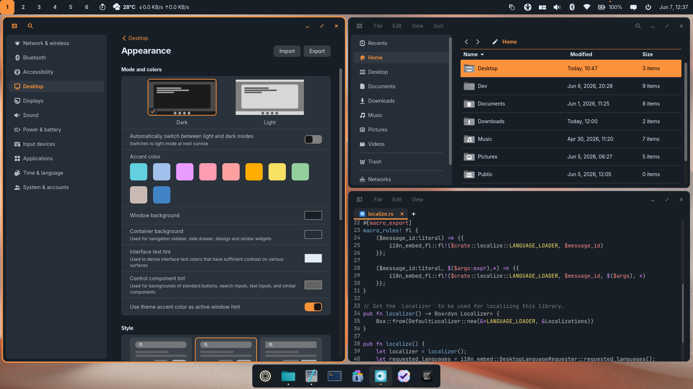
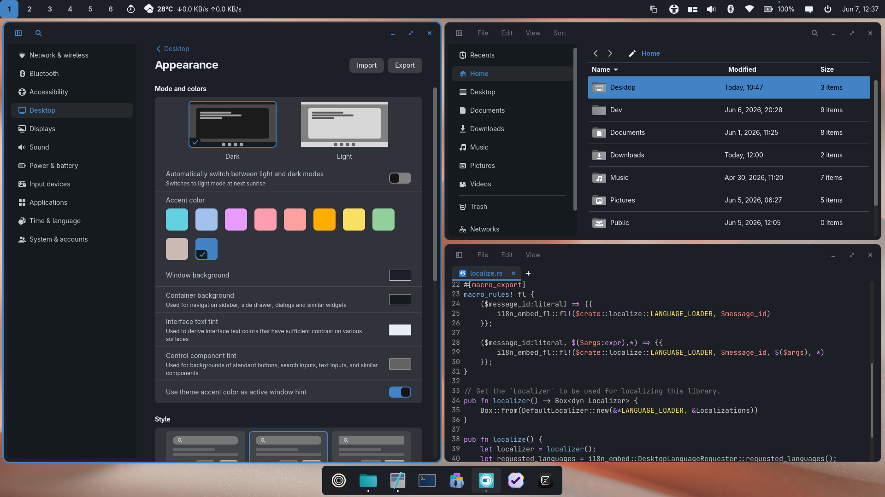
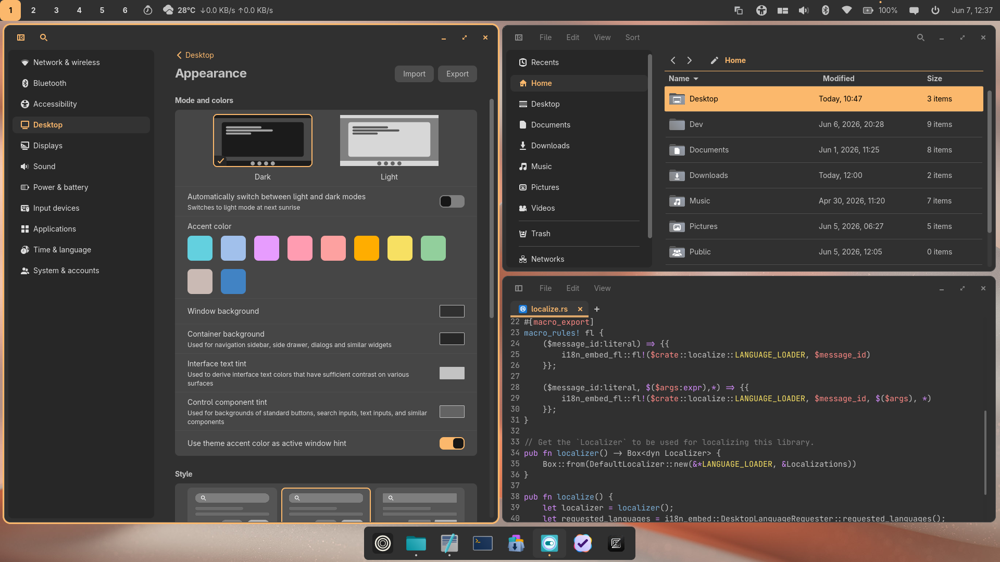
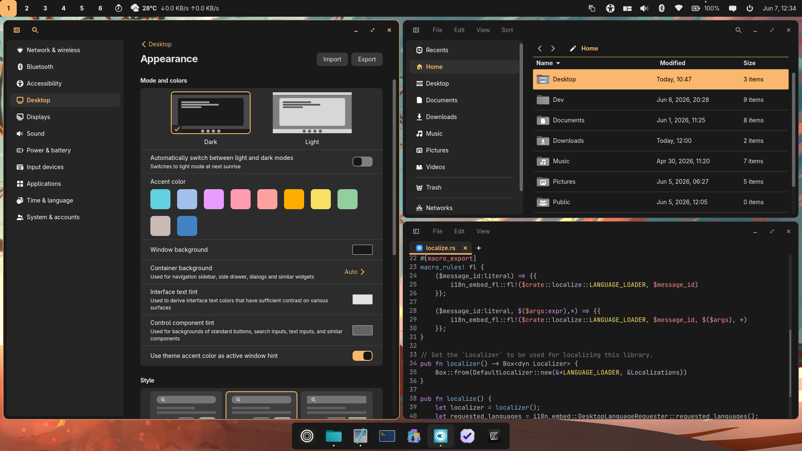
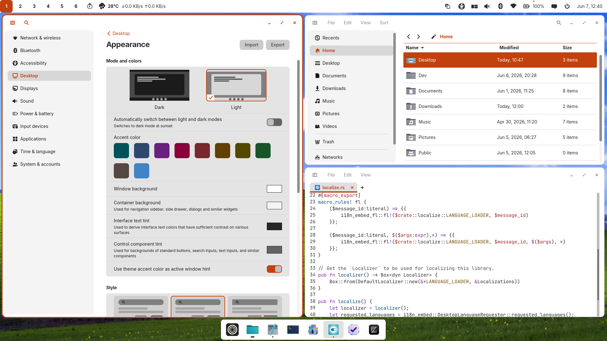
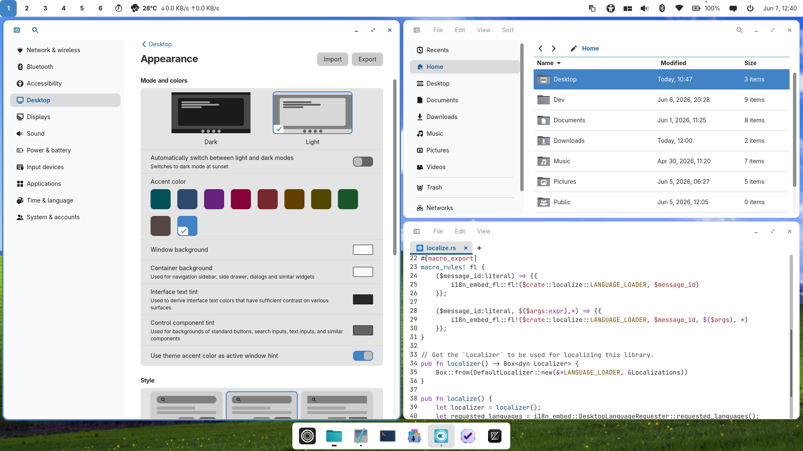
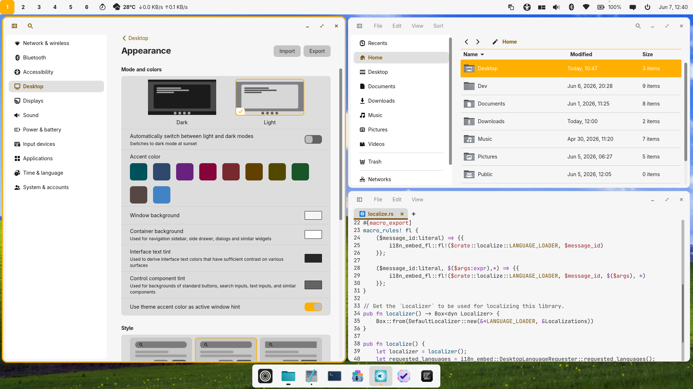
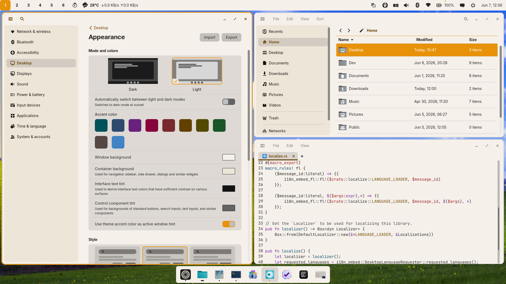

# COSMIC Desktop Themes

A collection of beautiful themes to customize and enhance the COSMIC Desktop Environment.

Note: This repository is not affiliated with the official COSMIC Desktop project.

## Official Themes

| **Comet Light** | **Cosmic Dark** |
|------------------|-----------------|
|  |  |

| **Cosmic Light** | **Creme Light** |
|------------------|-----------------|
|  |  |

| **Mocha Dark** | **Nebula Dark** |
|------------------|-----------------|
|  |  |

## Dark Themes

| **Accent Dark** | **Busy Bee** |
|------------------|-----------------|
|  |  |

| **Caramel Dark** | **Cosmic Abyss** |
|------------------|-----------------|
|  |  |

| **Cosmic Crimson** | **Flaming Ruby** |
|------------------|-----------------|
|  |  |

| **Forgejo Dark** | **Gitea Dark** |
|------------------|-----------------|
|  |  |

| **GNOME Cosmic Dark** | **Graphite Glow Dark** |
|------------------|-----------------|
|  |  |

| **Hot Iron** | **Lunar Eclipse** |
|------------------|-----------------|
|  |  |

| **Mint Dark** | **Monokai Dark** |
|------------------|-----------------|
|  |  |

| **Obsidian** | **Obsidian Ember Dark** |
|------------------|-----------------|
|  |  |

| **Ocean Mist** | **Omnitrix** |
|------------------|-----------------|
|  |  |

| **Shadcn Dark** | **Slate Core** |
|------------------|-----------------|
|  |  |

| **Steam Client** | **Sunset Ash Dark** |
|------------------|-----------------|
|  |  |

| **Ubuntu Classic Dark** | **Void Dream** |
|------------------|-----------------|
|  |  |

## Light Themes

| **Accent Light** | **Caramel Light** |
|------------------|-----------------|
|  |  |

| **Forgejo Light** | **Gitea Light** |
|------------------|-----------------|
|  |  |

| **GNOME Cosmic Light** | **Graphite Glow Light** |
|-------------------------|------------------------|
|  |  |

| **Lemon Grass** | **Maroon Mirage** |
|----------------|-------------------|
|  |  |

| **Mint Light** | **Monokai Light** |
|----------------|-------------------|
|  |  |

| **Obsidian Ember Light** | **Royal Orchid** |
|--------------------------|-----------------|
|  |  |

| **Shadcn Light** | **Sunset Ash Light** |
|------------------|----------------------|
|  |  |

| **Ubuntu Classic Light** | **Ubuntu Light** |
|--------------------------|-----------------|
|  |  |

### How to Apply a Theme
1. Open Cosmic Settings.
2. Navigate to Desktop > Appearance.
3. Import desired theme file. 

Enjoy customizing your desktop with themes made for COSMIC!
